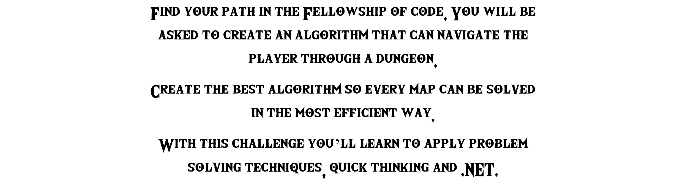

# Hack The Future 2020 - The Fellowship of Code

Welcome to the Hack The Future 2020 .NET Challenge! We hope you are ready and exited for a day of coding, hacking, frustration and lots of fun.

As the challenge above describes, you are to build a computer program, using C# and .NET, that navigates and hopefully solves a dungeon. You are the Fellowship Of Code, we are the dark agents that will challenge you with random dungeons. Please read this documentation carefully, so we can fully enjoy your suffering and agony!

* [Step 1 - Sit back and enjoy](#step-1---sit-back-and-enjoy)
* [Step 2 - Get your computer ready](#step-2---get-your-computer-ready)
* [Step 3 - Start Adventuring and Hacking](#step-3---start-adventuring-and-hacking)

# Step 1 - Sit back and enjoy

Thanks to the COVID-19 virus, we are limited in making you suffer :( Because of this, please sit back and relax in the comfort of your home. You will use [Thola](https://meet.thola.events/e/cronos/hack-the-future/r/lobby) to work and communicate.

You should attend the **Challenge Briefing** at **09:30**. For this, visit the Main Hall and enter the .NET Challenge room. Inside the .NET Challenge room, click the large TV in the center above the main door to join the Teams meeting.

During the day, you will work together with your partner. In the .NET Challenge room, you should find a desk that has your team name written on it, and click the PC on that desk to join a specific Teams call for your team. The dark agents will be able to join your team to help or ask difficult questions.

# Step 2 - Get your computer ready

You will need Visual Studio, Visual Studio Code or a similar tool to write C# and .NET code. Please follow the following steps to the letter in order to be eligible to become the winner of the Hack The Future 2020 .NET Challenge!

1. Fork this repository to your own GitHub account and work from there. Create a free account if needed.
2. Write code from **10:00** to **15:59** and commit/push regularly.
3. Stop coding and prepare for your pitch to our dark jury! No more GIT commits from **16:00** onwards!

# Step 3 - Start Adventuring and Hacking

The GitHub repository contains a Visual Studio solution with .NET Core 3.1 projects to help you develop your dungeoneering algorithm.

